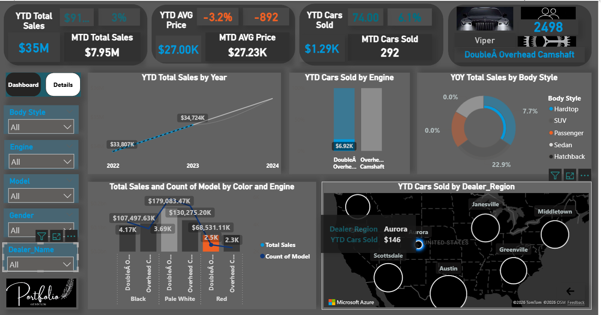
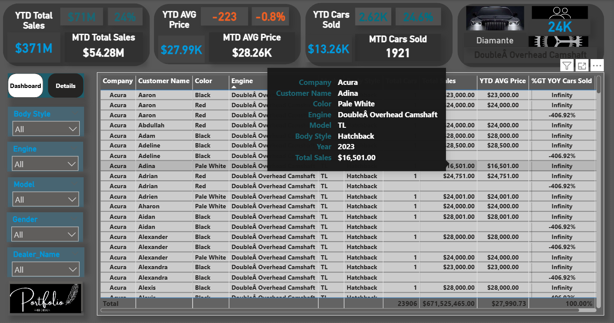

📊 Overview

   This project analyzes car sales data to understand revenue performance, customer behavior, product trends,
   and regional market dynamics. The dashboard     transforms raw data into interactive visuals that help stakeholders make faster and smarter business decisions.
   It tells a complete story of how sales evolve, which car models dominate the market, and how different customer segments contribute to overall revenue.
________________________________________
📈 Dashboard Visuals

   Sales Overview
   Revenue & KPIs
   Car Models Performance
   Regional Analysis
   Time Series Trends

________________________________________
🔍 Key Insights

   The analysis shows that a small number of car models and engine types dominate total revenue, while customer behavior is highly concentrated in specific    segments. Regional performance also varies significantly, with clear differences in demand across markets. 
   In addition, sales trends indicate strong seasonal patterns with noticeable peaks during certain months.
________________________________________

🛠 Tools & Technologies

Power BI, DAX, Power Query, Excel, and Star Schema Data Modeling were used to clean, transform, and visualize the data efficiently and at scale.
________________________________________
📁 Project Structure

   

________________________________________

## Dashboard Preview

 

 

💡 Skills Demonstrated

Data cleaning and transformation, data modeling using Fact and Dimension tables, advanced DAX calculations, KPI development, interactive dashboard design, and data storytelling.
________________________________________

👨‍💻 Author 

Mohammed Hamza 

Data Analyst | Data Visualization Specialist | Project Management Professional 

Experienced Project Manager with 5 years of expertise in leading and delivering successful projects across different domains. Transitioning into Data Analytics with strong skills in data visualization, dashboard development, and transforming data into actionable business insights
________________________________________
📌 Business Value

This dashboard helps businesses identify growth opportunities, optimize sales strategies, and understand customer behavior to improve decision-making based on real data.

